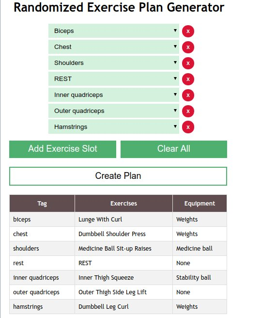

# Randomized Exercise Plan Generator

This project was created to practice full-stack development using React.js, Node.js, and MySQL.

It's the lazy way of thinking of new exercises to do at the gym!

## Creating MySQL database

This is assuming that a database "exercises" is already created with a table called "exercises".

The file "exercises.txt" contains a list of all the exercises to be loaded into the database.


```
$ mysql -u root -p --local-infile=1
mysql> use exercises
mysql[exercises]> LOAD DATA INFILE "exercises.txt"
     > INTO TABLE exercises
     > FIELDS TERMINATED BY '|'
     > ENCLOSED BY '"'
     > LINES TERMINATED BY "\n";
```

If it can't connect to the database after you've created it, run
```
$ sudo systemctl start mysqld
```

## Running the Node.js server (server.js)

```
$ node src/server.js
```

## Running the React.js client (index.js)

```
$ npm start
```

## Sample Use


